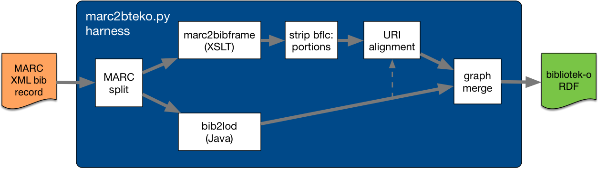

# Experiments/thoughts MARC to bibliotek-o conversion

What can we do as a stop-gap to leverage the LC [`marc2bibframe` XSLT](https://github.com/lcnetdev/marc2bibframe2) which does MARCXML to BIBFRAME2 RDF/XML conversion with [`bib2lod`](https://github.com/ld4l-labs/bib2lod) to handle fields that are differently converted according to the [bibliotek-o](https://bibliotek-o/) ontology?

## marc2bteko.py conversion harness

This is a Python program to use both the LC [`marc2bibframe` XSLT](https://github.com/lcnetdev/marc2bibframe2) and [`bib2lod`](https://github.com/ld4l-labs/bib2lod) for appropriate portions of a record.



  * **MARC split** - splits the input MARC record into portions for each converter, some fields are duplicated in both as they are necessary for the minimal record structure
  * **strip `bflc:` portions** -- the `marc2bibframe` XSLT includes a number of LC-specific additions that are not part of the bibliotek-o output desired, these are stripped
  * **URI alignment** - reconcile the URIs of the primary `bf:Work` and `bf:Instance` entities in the output RDF by adjusting those in the `marc2bibframe` output to match those in the `bib2lod` output
  * **graph merge** - easy in RDF, simply combine the sets of triples in order to write out a single RDF document for the bibliotek-o corresponding with the original MARC XML record

### Use

```
> python marc2bteko.py -v testdata/darwin_origin.xml 
INFO:root:Converting testdata/darwin_origin.xml -> darwin_origin.ttl...
INFO:root:Have 176 triples from BF conversion
INFO:root:Have 41 triples from bib2lod conversion
INFO:root:Writing 213 triples to darwin_origin.ttl
INFO:root:Done.
```

## Setup

The `vendor` directory include a JAR of [`bib2lod`](https://github.com/ld4l-labs/bib2lod) which does MARCXML to bibliotek-o conversion. This relies upon Java 8 ([AKA 1.8.x](https://en.wikipedia.org/wiki/Java_version_history)):

```
> java -version
java version "1.8.0_112"
...
```

The `vendor` directory includes LC [`marc2bibframe` XSL](https://github.com/lcnetdev/marc2bibframe2) which does MARCXML to BIBFRAME RDF/XML conversion. These XSLs can be used with `xsltproc` which for me reports:

```
> xsltproc --version
Using libxml 20900, libxslt 10128 and libexslt 817
xsltproc was compiled against libxml 20900, libxslt 10128 and libexslt 817
libxslt 10128 was compiled against libxml 20900
libexslt 817 was compiled against libxml 20900
```

For RDF format conversion I use `rapper` (so I never have to see any RDF/XML!):

```
> rapper --version
2.0.15
```

### Converting MARC -> BIBFRAME

```
> xsltproc vendor/marc2bibframe2-xsl/marc2bibframe2.xsl vendor/bib2lod/102063.min.xml | rapper -o turtle - http://example.org/ > tmp/102063-bf.ttl
rapper: Parsing file <stdin> with parser rdfxml and base URI http://example.org/
rapper: Serializing with serializer turtle and base URI http://example.org/
rapper: Parsing returned 48 triples
```

### Converting MARC -> bibliotek-o

```
> java -jar vendor/bib2lod/bib2lod.jar -c vendor/bib2lod/config.json; rapper -i turtle -o turtle -f xmlns:rdfs=\"http://www.w3.org/2000/01/rdf-schema#\" -f xmlns:bf=\"http://id.loc.gov/ontologies/bibframe/\" -f xmlns:bib=\"http://bibliotek-o.org/ontology/\" -f xmlns:dct=\"http://purl.org/dc/terms/\" -f xmlns:vivo=\"http://vivoweb.org/ontology/core#\" tmp/102063.min.ttl http://example.org/ > tmp/102063-bteko.ttl
15:14:06.093 INFO  org.ld4l.bib2lod.managers.SimpleManager line 39 - START CONVERSION.
15:14:06.793 INFO  org.ld4l.bib2lod.managers.SimpleManager line 44 - END CONVERSION.
rapper: Parsing URI file:///Users/simeon/src/bteko2bf/tmp/102063.min.ttl with parser turtle and base URI http://example.org/
rapper: Serializing with serializer turtle and base URI http://example.org/
rapper: Parsing returned 31 triples
```

